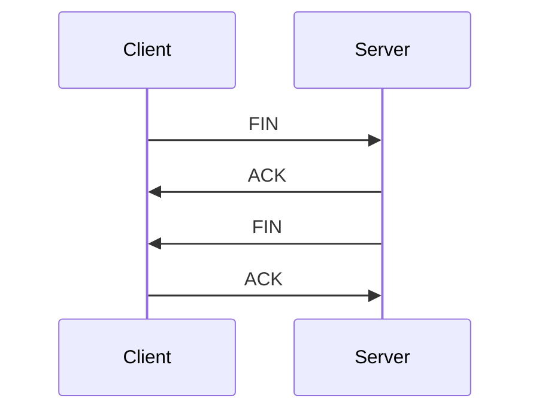
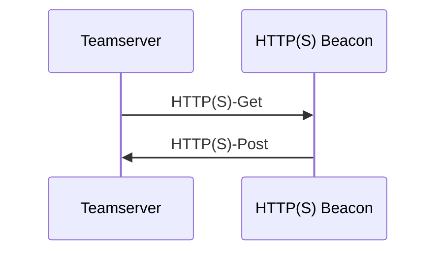

::: info
笔记
:::

## About

C&C（command and control），攻击者使用命令和控制基础设施向受害者发出指令

## C2

- Apfell
- Caldera
- Cobalt Strike
- Covenant
- Dali
- Empire
- EvilOSX
- Faction C2
- FlyingAFalseFlag
- godoh
- ibombshell
- INNUENDO
- Koadic C3
- MacShellSwift
- Metasploit
- Merlin
- Nuages
- Octopus
- PoshC2
- Prismatica
- PowerHub
- Red Team Toolkit
- ReverseTCPShell
- SCYTHE
- SilentTrinity
- Sliver
- Trevor C2
- Weasel

## Detection

### Long Connections

**Identify the long-lived network connections.**

#### TCP

**（1）3-Way Handshake Connection Start** 

SYN, SYN/ACK, ACK

 ``` mermaid
   sequenceDiagram
     Client->>Server: SYN
     Server->>Client: SYN/ACK
     Client->>Server: ACK
 ```

**（2）4-Way Handshake Connection End** 

FIN, ACK, FIN, ACK



#### UDP

UDP 不同于 TCP 是 stateless protocols

会话在看到第一个 UDP 数据包时开始，在时间窗口的持续时间内不再看到 UDP 数据包时结束

### Beacons

Identify command & control (C2) sessions using **regular connections** between two IP addresses, in other words, **finding the connections that happen on regular time intervals**.

Beacon 是一种轻量级的通信后门程序，通常用于在受害者计算机上建立持久性访问权限，并与攻击者的控制服务器进行通信

安全设计

- Beacon 使用团队服务器的公钥加密传输的元数据，只有团队服务器才能解密这些信息
- Beacon 传输 Payload 到目标系统时，会验证团队服务器密钥，确保只接受来自团队服务器的任务
- 设置睡眠（Sleep）和抖动（Jitter）时间，Sleep 控制 Beacon 在再次请求前必须睡眠多长时间，Jitter 会改变睡眠时间，从而显示出随机性
- ……

#### 通信模式

- **异步式通信**：Beacon 固定一段时间（由 Sleep 时间决定，可调整）向 Teamserver 发起通信，接受本次命令并回传上次执行命令后的结果
- **交互式通信（Sleep 0）**：由 Client 发出的指令通过 Teamserver（或再经过外部 C2）直接转发给 Beacon 并执行命令

#### 分类

**（1）HTTP (S) Beacon**

- 相比 HTTP Beacon ，HTTPS Beacon 多了 SSL/TLS 协议，可以保证数据传输中信息不被截取或发生中间人攻击等
- 一般情况下，使用 Get 方式请求任务，使用 Post 方式回传数据



**（2）SMB Beacon**

- SMB(Server Message Block)，该协议最初由微软开发，用于在 Windows 系统中实现文件和打印机共享，后来被广泛用于其他操作系统和网络设备中，我们常用的内网目录共享有些就是通过 SMB 协议实现的
  - 命名管道（Named Pipe）：适用于持久性、跨进程、双向通信的场景
  - 匿名管道（Anonymous Pipe）：适用于临时、有亲缘关系的进程间的单向数据传递
- 使用命名管道并通过一个父 Beacon 进行通信，管道通信的进程可以是本地主机上的两个进程，也可以和远程主机上的进程通过网络进行通信
- Beacon Covert Peer-to-Peer Communication（隐蔽点对点通信）
- Beacon Peer as a Payload（作为 Payload 通信）

**（3）DNS/DoH Beacon**

- DNS 协议可以使用 UDP 或者 TCP 进行传输，使用的端口号都为 53
- DNS Beacon 同时利用了两种查询方式
  - 迭代查询
  - 递归查询
- 数据传递方式，DNS Beacon 支持三种
  - A 记录（mode dns）：A 记录是最常见的 DNS 记录形式，一个 A 记录指向一个网站或域名的 IP 地址
  - AAAA 记录（mode dns6）：AAAA 记录是 IPv6 协议的一部分，能被用来为互联网上的主机分配 IPv6 地址
  - TXT 记录（mode dns-txt）：允许以文本格式添加关于域名的额外信息，是 DNS Beacon 的默认传递方式
- DNS Beacon 与 HTTP(S) Beacon 最大的区别是心跳时不会主动回传被控端的数据，仅有一个最后通联时间返回，使用 Beacon 控制台输入 `checkin` 可使心跳时返回数据，但如果通过 DNS Beacon 对受控主机执行命令时则会自动执行 `checkin` 返回数据

**（4）TCP Beacon**

- TCP Beacon 使用 TCP socket 通过父 Beacon 进行通信，且对同一主机和跨网主机都适用
- TCP Beacon 整体来说与 SMB Beacon 的特性相同，都需要从父 Beacon 对它3进行控制，包括兼容性方面也与 SMB Beacon 一致

**（5）ICMP Beacon**

**（6）FTP Beacon**

**（7）IMAP Beacon**

**（8）MAPI Beacon**

#### 检测原理

- <font color=red>理想的 beacon 通信行为应该具有通信间隔和数据大小呈现**对称分布**的特征</font>
- <font color=red>理想的 beacon 通信行为在其通信间隔的**中位数**周围应该具有很低的**分散度**</font>
- <font color=red>在行为特征上，beacon 通信时往往具有**较高的连接数**</font>

对同源目的 IP 间的通信进行分数计算得到 score，其值分布为 0~1 之间，趋近 1 则疑似 beacon 通信行为

根据**通信间隔**和**数据包大小**的特征，分别计算出 **tsScore** 和 **dsScore**，最后取均值得到 **score**

**1、通信间隔**

**（1）偏度 tsSkewScore**

采用 Bowley 偏度公式来度量对称性，所谓的偏度系数，适用于描述曲线形状的对称性，其值在 1 到 -1 之间，分别代表着正偏斜或负偏斜


具体计算时需要对数据集按大小顺序作四等分，在三个分位点依次取值：tsLow(Q1)，tsMid(Q2)，tsHigh(Q3)

$Bowley \ Skewness = \frac{Q1 + Q3 - 2Q2}{Q3 - Q1}$​

> 注：如果分母为 0，Q2 = Q1 或 Q2 = Q3，则计算结果不可靠，tsSkew 取 0

最后根据 tsSkew 算出：$tsSkewScore = 1 – \left| tsSkew \right|$  更低的偏度值取得更高的分数

**（2）分散度 tsMadmScore**

MADM（Median Absolute Deviation about the Median）

$tsMadm = median(|[x] - median[x]|)$ 计算每个元素与中位数差值的绝对值，再取这些绝对值的中位数

以 30 s 为阈值，超出则分数记为 0：

```python
http_df['tsMadmScore'] = 1.0 - http_df['tsMadm'] / 30.0
http_df['tsMadmScore'] = http_df['tsMadmScore'].apply(lambda x: 0 if x < 0 else x)
```

**（3）通信次数 tsConnCountScore**

利用通信的持续时间和连接次数计算得到：$tsConnCountScore = \frac{ConnectionCoun}{(tsConnDiv / 10.0)}$​

- ConnectionCount 代表通信次数
- tsConnDiv 由通信起止时间除以固定的连接频率得来，此处该值取为 **10 秒**

最后得分如果大于 1，则向下舍入取 1，因为连接得越频繁，越有可能是 beacon 通信

**（4）综上**

$tsScore = \frac{tsSkewScore + tsMADMScore + tsConnCountScore}{3.0}$

**2、数据包大小**

同理可得

**（1）偏度 dsSkewScore**

**（2）分散度 dsMadmScore**

以 32 字节为阈值，超出则分数记为 0：

```python
http_df['dsMadmScore'] = 1.0 - http_df['dsMadm'] / 32.0
http_df['dsMadmScore'] = http_df['dsMadmScore'].apply(lambda x: 0 if x < 0 else x)
```

**（3）dsSmallnessScore**

由于 beacon 通常都是较小的数据包，这里采用 dsSmallnessScore 作为衡量指标

如果数据包大小的众数(Mode)超过 **65 Kb**，则得分为 0

```python
http_df['dsSmallnessScore'] = http_df[data_size].apply(lambda x: 1- (np.argmax(np.bincount(x)) / 65535))
http_df['dsSmallnessScore'] = http_df['dsSmallnessScore'].apply(lambda x: 0 if x < 0 else x)
```

**（4）综上**

$dsScore = \frac{dsSkewScore + dsMADMScore + dsSmallnessScore}{3.0}$

**3、最终得分**

$score = \frac{tsScore + tsScore}{2.0}$

### DNS


### JA3/JA3S Hashes


### JARM


## Reference

- https://c2matrix.webflow.io/matrix
- https://activecm.github.io/threat-hunting-labs/basic_usage/
- https://zhuanlan.zhihu.com/p/656697509?utm_psn=1754463206125658112
- https://wikileaks.org/vault7/document/hive-Operating_Environment/hive-Operating_Environment.pdf
- https://www.anquanke.com/post/id/266379
- https://en.m.wikipedia.org/wiki/Skewness#Quantile-based_measures
- https://github.com/activecm/rita/blob/master/pkg/beacon/analyzer.go