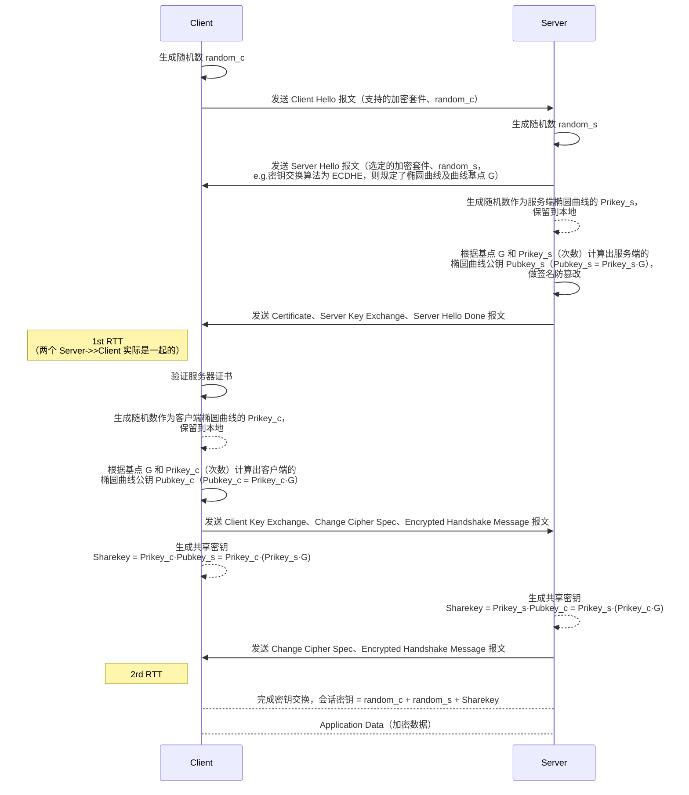
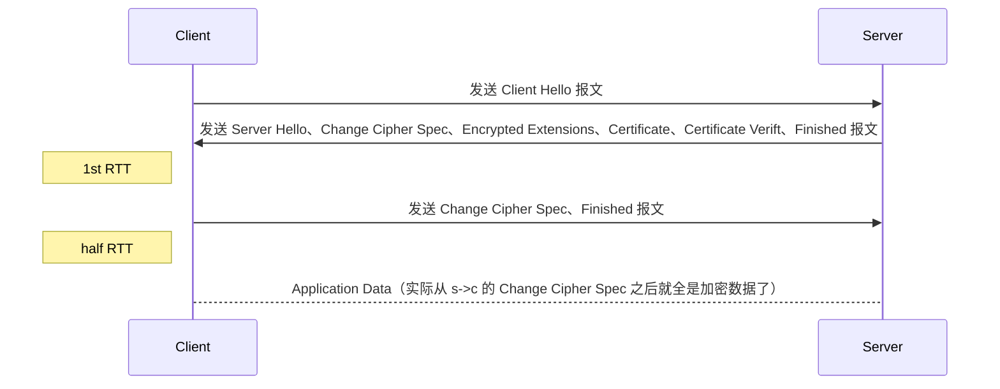

# TLS

​		区别于**应用层面**的**降级攻击**，**网络协议层面**的**协商机制**也可以实施降级攻击，因此以最典型的 TLS 为例，先侦查其原理，并根据抓包结果分析 TLS1.2 和 TLS1.3 的不同之处。

## Core

- RSA 的主要困难是模数N的分解
- DH 是基于离散对数的算法，DH 的主要困难是求解离散对数
- ECC 是基于椭圆曲线的算法，ECC 的难度也是求解离散对数

## TLS1.2（ECDHE）

**Download packages**：https://drive.google.com/file/d/16QnUSd3BLEM1LpkA5pUdBjugdsObFE24/view?usp=drive_link

### 1.1.Client->>Server: Client Hello

- `Random`：客户端产生的随机数 random_c，用于生成最终密钥
- `Session ID`：会话标识符，如果是一个新的连接，这个值为0
- `Cipher Suites`：加密套件（客户端共支持 21 个加密套件），服务器会从中选择一个服务器也支持的加密套件
- `Compression Methods`：客户端支持的压缩方法
- `Extension: ALPN`：客户端支持的应用层协议
- `Extension: signature_algorithms`：客户端支持的签名算法

> ⚠️注意：扩展是 TLS1.3 才开始使用的，在之前的版本是没有的，所以扩展是 1.3 的显著特征

### 1.2.1.Server->>Client: Server Hello

- `Random`：服务器生成的随机数 random_s
- `Cipher Suites`：服务器选择的加密套件
  - 密钥协商算法：`ECDHE`
  - 签名算法：`RSA`
  - 握手后的通信：`AES`，密钥长度 128 位，分组模式是 GCM
  - 摘要算法：`SHA256`

- `Compression Methods`：服务器选择的压缩算法为 NULL 压缩算法，即不支持任何压缩算法，压缩基本由应用层来完成

### 1.2.2.Server->>Client: Certificate

- `Certificate`：服务器返回了三个证书， 第一个是 CA 签发的证书（opencve），其它是 CA 链的证书

​		客户端收到这个证书后，可以根据证书链来验证证书的真伪，进而判断服务器是真是假。 

​		服务器证书中存放一个公钥，用于加密后面生成的 Premaster secret。

### 1.2.3.Server->>Client: Server Key Exchange

- `EC Diffie-Hellman`：服务器和浏览器是通过 Diffie-Hellman 算法来生成最终的密钥
- `Pubkey`：服务器向客户端发送了 Pubkey，即椭圆曲线的公钥

### 1.2.4.Server->>Client: Server Hello Done

​		告知客户端服务器这边握手相关的消息发送完毕。

### 2.1.1.Client->>Server: Client Key Exchange

- `Pubkey`：浏览器收到服务器发来的 Certificate 包来之后，运行 Diffie-Hellman 算法生成一个 pubkey，然后发送给服务器

​		通过这一步和上面 Certificate 两个步骤，服务器和浏览器分别交换了 pubkey，这样他们就可以分别生成了一个一样的 sessionkey。

​		最终的会话密钥 = random_c + random_s + Sharekey，之所以这么麻烦，是因为 TLS 设计者不信任客户端或服务器「伪随机数」的可靠性，为了保证真正的完全随机，把三个不可靠的随机数混合起来，那么「随机」的程度就非常高了，足够让黑客计算出最终的会话密钥，安全性更高。

### 2.1.2.Client->>Server: Change Cipher Spec

​		变更密码规范协议，它非常简单，就是一条通知消息，告知对方以后的通信都是加密的。

### 2.1.3.Client->>Server: Encrypted Handshake Message

​		客户端使用生成的对话密钥，加密之前所有收发握手消息的 Hash 和 MAC 值，发送给服务器，服务器将相同的会话密钥（使用相同方法生成）解密此消息，校验其中的 Hash 和 MAC 值。

> ⚠️注意：Change Cipher Spec 和 Encrypted Handshake Message 不像 Client Hello、Server Hello 等是封装在 Handshake Protocol 层，而是同 Handshake Protocol 一样，直接封装在 TLS Record Layer 层。

### 2.2.1.Server->>Client: Change Cipher Spec

​		服务器发送 Change Cipher Spec 消息，通知客户端此消息以后服务器会以加密方式发送数据。

### 2.2.2.Server->>Client: Encrypted Handshake Message

​		服务器使用会话密钥加密之前所有收发握手消息的 Hash 和 MAC 值，发送给客户端去校验。

### Application Data

​		发送加密数据。

## TLS1.3

- 废弃了 3DES、RC4、AES-CBC 等加密组件
- 废弃了 SHA1、MD5 等哈希算法

​		在 ChangeCipherSpec 消息之后，没有加密扩展、证书，甚至 Finished 消息都没有，这是因为 ChangeCipherSpec 之后的消息都是进行加密了的，Wireshark 没有对后续的消息进行解密，所以只是显示了 ApplicationData，即加密传输的数据。

**Download packages**：https://drive.google.com/file/d/1ZqmhaqYJnbP3IupVkvZD9QvJ_L0C8Xio/view?usp=drive_link

### 1.1.Client->>Server: Client Hello

- `Random Bytes`：客户端产生的随机数 random_c，用于生成最终密钥
- `Session ID`：会话标识符，如果是一个新的连接，这个值为0
- `Cipher Suites`：加密套件（客户端共支持 21 个加密套件），服务器会从中选择一个服务器也支持的加密套件
- `Compression Methods`：客户端支持的压缩方法
- `Extension: ALPN`：客户端支持的应用层协议
- `Extension: signature_algorithms`：客户端支持的签名算法

- `Extension: key_share`：客户端支持的签名算法，此处包含两个 Key Share Entry，第一个是预留的空值，第二个是 x25519 曲线组，具体数据在 KeyExchange 字段中；每个 KeyShareEntry 都代表一组密钥交换参数

> ⚠️注意：客户端和服务器之间使用 key_share 扩展来协商密钥交换所使用的曲线组，客户端会在 ClientHello 消息中发送支持的椭圆曲线组列表给服务器，虽然客户端提供了曲线组的选择范围，但实际上由服务器在这些范围内进行最终的曲线组选择

- `Extension: psk_key_exchange_modes`：PSK 密钥交换模式选择，此处的 PSK 模式为 (EC)DHE 下的 PSK，客户端和服务器必须提供 KeyShare；如果是仅 PSK 模式，则服务器不需要提供 KeyShare。

> ⚠️注意：扩展是 TLS1.3 才开始使用的，在之前的版本是没有的，所以扩展是 1.3 的显著特征

### 1.2.Server->>Client: Server Hello

- `Random`：服务器生成的随机数 random_s
- `Cipher Suites`：服务器选择的加密套件
  - 密钥协商算法：`null`，固定使用 PSK 机制
  - 签名算法：`null`，后续直接加密了，不需要签名了
  - 握手后的通信：`AES`，密钥长度 128 位，分组模式是 GCM
  - 摘要算法：`SHA384`

- `Compression Methods`：服务器选择的压缩算法为 NULL 压缩算法，即不支持任何压缩算法，压缩基本由应用层来完成

### 1.3.Server->>Client: Change Cipher Spec

​		服务器发送 Change Cipher Spec 消息，通知客户端此消息以后服务器会以加密方式发送数据。

### 1-RTT

​		TLS1.2 中 Client 发送自己支持的椭圆曲线类型（Client Hello 报文中 extension 携带支持的椭圆曲线类型），然后等待 Server 选择后，才计算自己的公钥（根据客户端自身性能支持几个公钥）然后发送给 Server，所以才会有两个 RTT。

​		TLS1.3 中把计算出的自己的公钥直接放到 Client Hello 报文中（extension 的 keyshare），因此少了一个 RTT，但相应的，TLS 1.3 在握手过程中减少了客户端对服务器验证证书的步骤，在 TLS 1.3 中，客户端仍然会从服务器端收到证书，但客户端验证该证书并不是必需的。

​		尽管客户端验证证书的步骤被简化了，但 TLS 1.3 仍然提供了其他安全机制，包括使用安全的密钥交换算法和加密套件来保护通信的机密性和完整性。

### 密钥协商机制 PSK 实现 0-RTT

​		PSK 是 Pre-Shared Key（预共享密钥）的缩写。它是一种在计算机网络通信中用于安全密钥协商的机制。在 PSK 机制中，通信双方**事先共享一个密钥**，并将其作为身份验证和加密通信的基础。在建立连接之前，双方都需使用该密钥进行身份验证，确保彼此信任并具备相应权限。这种方式可用于保护无线网络、VPN 等各种网络通信，提供更高的安全性与数据保护。

​		TLS1.3 引入了一种称为 "0-RTT" 的功能，可以通过使用先前建立的会话密钥来加速握手过程，此时 1.1 中在 Client Hello 时就把应用数据捎带发给 Server，即发送 Client Hello、Change Cipher Spec、Application Data 报文。

## 协商问题

​		在 TLS 握手中，客户端按优先顺序显示其支持的密码套件列表，如果客户端和服务端支持的密码套件有重合，那么服务器会从这个列表中选择一个密码套件，否则会话建立就可能失败。

​		客户端将它支持的密码套件首选项传递给服务器，由服务器选择最终的密码套件，这种模式很重要，因为它保留了客户端/服务器、消费者/生产者的**协商关系**。

​		基于上述原理，**系统的整体安全性取决于较弱的客户端能提供的最强密码套件**，密码套件协商被认为是现代加密协议中的反模式。

​		由于历史原因，许多在线资源支持弱密码套件以保持与旧客户端的后向兼容性，因此已经有许多针对密码套件协商的攻击（如降级攻击）攻击者能够削弱客户端使用的加密算法，建议服务器只支持最合理的密码套件。

​		在数据中心部署的场景下，这个列表可能只限于少数几个经过批准的套件，因为这种场景对“客户端”有严格的控制。然而，对于真正面向客户的部署，这种做法并不合理。

​		目前较新的协议和框架，如 Noise，旨在消除协议协商。

## Reference

- https://blog.csdn.net/m0_50084718/article/details/113377136
- https://www.cnblogs.com/xiaolincoding/p/14318338.html
- [TLS1.3](https://blog.csdn.net/SkyChaserYu/article/details/105840504?ops_request_misc=%257B%2522request%255Fid%2522%253A%2522168785418416800182138639%2522%252C%2522scm%2522%253A%252220140713.130102334..%2522%257D&request_id=168785418416800182138639&biz_id=0&utm_medium=distribute.pc_search_result.none-task-blog-2~all~sobaiduend~default-2-105840504-null-null.142^v88^control_2,239^v2^insert_chatgpt&utm_term=tls抓包分析&spm=1018.2226.3001.4187)
- [TLS1.3](https://blog.csdn.net/mrpre/article/details/81532469)
- [1.3 vs 1.2](https://zhuanlan.zhihu.com/p/44980381)